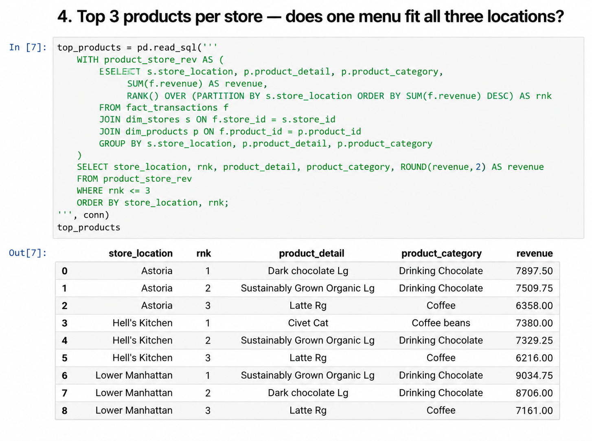
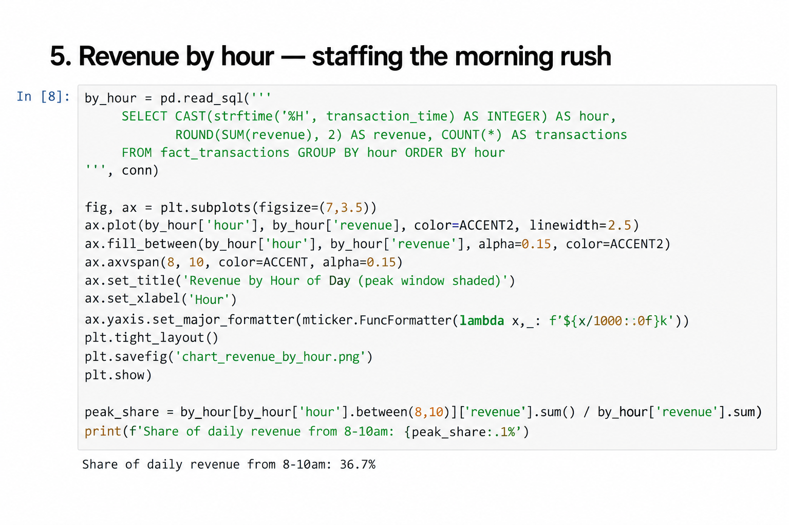
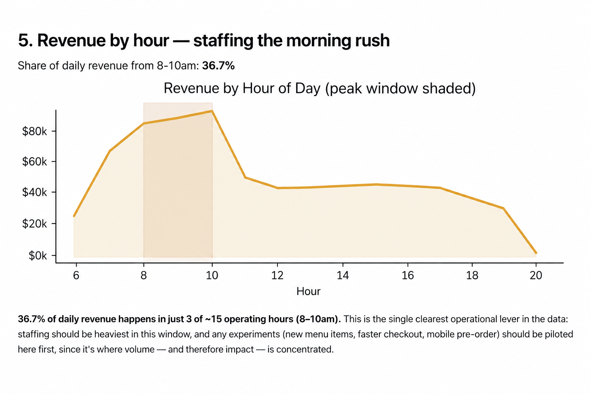

# Coffee Shop Sales Analysis | SQL + Python

## Project Overview

This project builds on my Excel sales analysis by taking the same coffee shop transaction data into a relational database and using **SQL and Python** for deeper analysis.

The dataset contains six months of transaction history across three New York City coffee shop locations. I normalized the data into a SQLite database, wrote SQL queries to investigate business performance, and used Python with pandas to run and explore the query results.

The goal was to move beyond spreadsheet-based reporting and demonstrate how SQL and Python can be used to structure, query, analyze, and communicate business data.

---

## Business Question

**How should the business staff its stores, prioritize its menu, and plan for future performance based on six months of transaction history across three locations?**

The analysis explored questions including:

- How does revenue compare across stores?
- How is revenue changing month over month?
- Which products perform consistently across locations?
- Are there location-specific product preferences?
- What hours generate the highest revenue?
- Are there data-quality issues that could affect future pricing or margin analysis?

---

## Tools & Technologies

- SQL
- SQLite
- Python
- pandas
- Jupyter Notebook
- Relational database design
- Data visualization

---

## Database Design

The original flat transaction data was transformed into a relational structure containing one fact table and two dimension tables:

```text
dim_stores
├── store_id (PK)
└── store_location

dim_products
├── product_id (PK)
├── product_category
├── product_type
└── product_detail

fact_transactions
├── transaction_id (PK)
├── transaction_date
├── transaction_time
├── store_id (FK)
├── product_id (FK)
├── transaction_qty
├── unit_price
└── revenue
```

### Pricing Design Decision

`unit_price` was kept on the transaction fact table rather than the product dimension.

During normalization, **15 of 80 products were found at more than one historical unit price**. Treating price as a fixed product attribute could therefore hide legitimate price variation and potentially distort later pricing or margin analysis.

This issue was retained and flagged for business validation rather than silently forcing one price per product.

---

## SQL Analysis

The project contains **12 documented SQL queries**, progressing from core aggregations to more advanced analysis.

SQL techniques demonstrated include:

- Joins across fact and dimension tables
- Common Table Expressions (CTEs)
- Window functions
- `LAG()` for period-over-period comparisons
- `RANK()` for product performance
- Running totals
- 7-day moving averages
- Correlated subqueries
- Subqueries in `FROM`
- `HAVING`
- `CASE`
- SQLite date functions using `strftime()`

The complete queries are available in [`queries.sql`](./queries.sql).

---

## Python Analysis

Python was used alongside SQL to make the analysis reproducible and easier to explore.

The Jupyter notebook uses **pandas** to execute SQL queries against the SQLite database, inspect the resulting data, create visualizations, and document the business findings.

[View the SQL + Python notebook](./coffee_sales_sql_analysis.ipynb)

---

## Analysis Preview

### SQL: Top Products by Store

This analysis uses a CTE, joins, aggregation, and `RANK() OVER (PARTITION BY ...)` to identify the top three products at each store.



### Python: Querying and Visualization

Python is used to execute SQL with `pandas.read_sql()`, calculate the peak-period revenue share, and create the hourly revenue visualization with Matplotlib.



### Business Visualization: Revenue by Hour

The resulting chart shows that **36.7% of daily revenue occurs between 8:00 AM and 10:00 AM**, making this the most important staffing window in the dataset.



---

## Key Findings

### Store Performance

Revenue was distributed relatively evenly across all three stores, with performance within approximately **1.5 percentage points** across locations.

This suggests that overall performance is not dependent on one dominant store.

### Revenue Growth

The data showed consecutive months of strong revenue growth through the middle of the six-month period, with growth easing in June.

This trend would be worth validating against additional months of data before using it for longer-term forecasting.

### Product Performance

Two products ranked among the **top three products at every store**, suggesting they are strong candidates for company-wide promotion or menu visibility.

The analysis also identified a local top-selling product at the Hell's Kitchen location that was not shared by the other stores, highlighting the value of store-level product analysis.

### Peak Sales Hours

Approximately **36.7% of daily revenue occurred between 8:00 AM and 10:00 AM**, despite this representing only three of roughly fifteen operating hours.

This makes the morning period one of the clearest opportunities for staffing and operational planning.

### Data Quality

**15 of 80 products showed multiple historical unit prices.**

This was flagged as a data-quality and business-validation issue before performing deeper pricing or margin analysis.

---

## Business Recommendations

Based on the analysis:

- Prioritize staffing capacity during the 8–10 AM peak revenue period.
- Maintain strong availability and visibility for products that consistently rank highly across locations.
- Use store-level product performance when planning local promotions rather than assuming every location has identical customer preferences.
- Validate historical price variation before building pricing, margin, or profitability analysis.
- Continue collecting additional months of data before treating the observed revenue-growth pattern as a long-term trend.

---

## Project Files

| File | Purpose |
|---|---|
| [`schema.sql`](./schema.sql) | Defines the relational database tables, keys, and design decisions |
| [`build_db.py`](./build_db.py) | Builds the normalized SQLite database from the original source workbook |
| [`queries.sql`](./queries.sql) | Contains the 12 documented SQL analysis queries |
| [`coffee_sales_sql_analysis.ipynb`](./coffee_sales_sql_analysis.ipynb) | Runs SQL through pandas, visualizes results, and documents findings |
| `coffee_shop.db` | Ready-to-use SQLite database used for the analysis |

---

## Reproducing the Analysis

The repository includes the completed `coffee_shop.db`, so the SQL queries and Jupyter notebook can be explored without rebuilding the database from the original Excel source.

The original raw workbook used by `build_db.py` is not duplicated in this project folder. The build script is included to demonstrate the data preparation and database-building workflow.

To explore the existing database and notebook:

```bash
pip install pandas matplotlib jupyter
jupyter notebook coffee_sales_sql_analysis.ipynb
```

The SQL queries can also be reviewed directly in [`queries.sql`](./queries.sql).

---

## Skills Demonstrated

This project demonstrates my ability to:

- Transform flat data into a relational database structure
- Design fact and dimension tables
- Write analytical SQL queries
- Use joins, CTEs, subqueries, and window functions
- Query databases from Python using pandas
- Investigate data-quality issues instead of ignoring them
- Analyze trends across time, stores, products, and operating hours
- Translate technical analysis into business recommendations
- Build a reproducible analysis workflow

---

## Related Projects

[← Project 1 — Excel Sales Analysis](../project-1-excel-analysis/)

[Project 3 — Interactive Dashboard →](../project-3-dashboard/)
