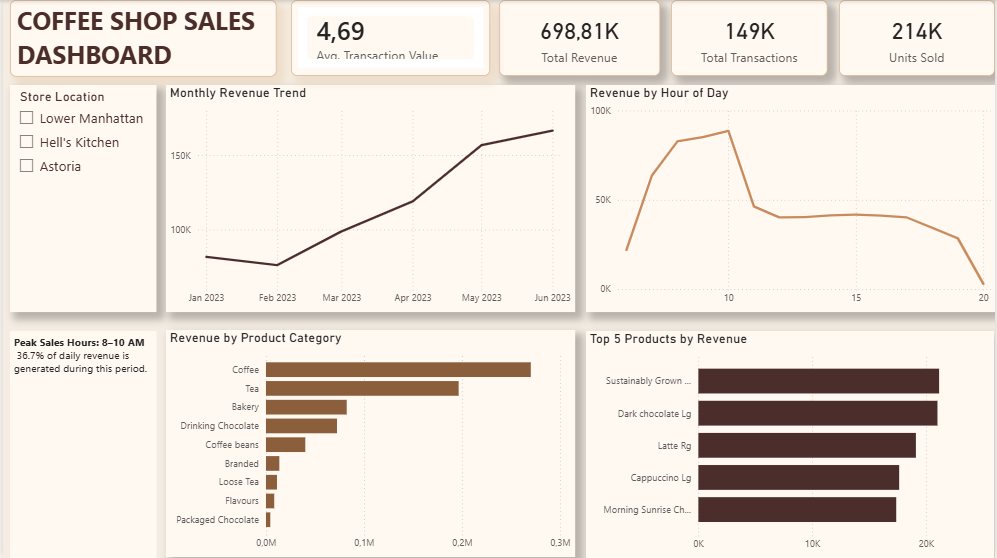

# Coffee Shop Sales Dashboard | Power BI

## Project Overview

This project presents an interactive Power BI dashboard built from 149,116 coffee shop transactions across three New York City locations. The goal was to turn detailed sales data into a clear management dashboard that highlights revenue trends, product performance, store activity, and peak trading periods.

This project focuses on dashboard design, DAX measures, interactive filtering, and communicating business insights visually.

## Business Question

How can a store manager quickly understand overall sales performance, identify key revenue drivers, and recognize the busiest trading periods across locations?

## Dashboard Preview



## Key KPIs

- Total Revenue: **$698.81K**
- Total Transactions: **149K**
- Units Sold: **214K**
- Average Transaction Value: **$4.69**

## Dashboard Features

- Interactive **Store Location** slicer
- Monthly revenue trend
- Revenue by hour of day
- Revenue by product category
- Top 5 products by revenue
- KPI cards for revenue, transactions, units sold, and average transaction value
- Business insight callout highlighting the morning peak period

## DAX Measure

A custom DAX measure was created for Average Transaction Value:

```DAX
Average Transaction Value =
DIVIDE(
    [Total Sales],
    [Total Transactions],
    0
)
```

## Key Insights

- Revenue increased strongly from March through June, with June producing the highest monthly revenue.
- Coffee is the leading product category by revenue, followed by Tea.
- The **8–10 AM** period is the most important sales window and generates approximately **36.7% of daily revenue**, making it a key staffing period.
- Revenue is well distributed across the three store locations, allowing managers to compare performance using the interactive slicer.
- A small group of products contributes a significant share of product-level revenue.

## Business Recommendations

- Prioritize staffing and product availability during the 8–10 AM peak period.
- Maintain strong inventory levels for top-performing Coffee and Tea products.
- Use the Store Location slicer to compare local performance before planning store-specific promotions.
- Continue monitoring monthly revenue trends to determine whether the growth observed through June is sustained over a longer period.

## Skills Demonstrated

- Power BI dashboard development
- DAX measures
- KPI design
- Interactive slicers and cross-filtering
- Data visualization
- Business insight communication
- Dashboard layout and visual hierarchy
- Data-driven recommendations

## Project Files

- [`Coffee Shop Sales Power BI Dashboard.pbix`](./Coffee%20Shop%20Sales%20Power%20BI%20Dashboard.pbix) — Power BI project file
- [`power-bi-dashboard.png`](./power-bi-dashboard.png) — dashboard preview image

## Related Projects

- [Project 1 — Excel Sales Analysis](../project-1-excel-analysis/)
- [Project 2 — SQL + Python Analysis](../project-2-sql-python/)
- [Project 4 — Business Case Study](../project-4-case-study/)
